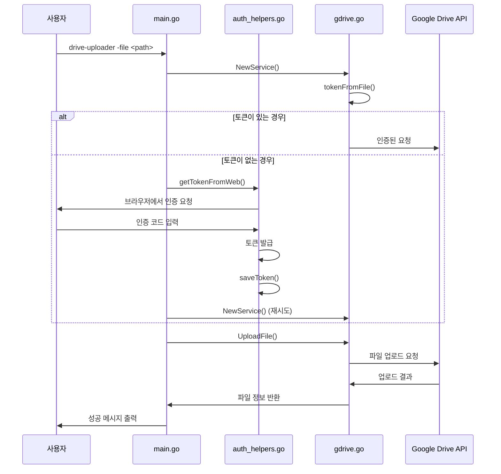

# 시스템 아키텍처

## 전체 구조

Drive Uploader는 Clean Architecture 패턴을 기반으로 설계되어 각 계층의 책임을 명확히 분리하고 유지보수성을 높였습니다.

```
drive-uploader/
├── cmd/
│   └── drive-uploader/          # 애플리케이션 진입점
│       ├── main.go              # 메인 실행 로직
│       └── auth_helpers.go      # 인증 헬퍼 함수들
├── internal/                    # 내부 패키지 (외부 노출 안됨)
│   ├── config/                  # 설정 관리
│   │   └── config.go
│   └── gdrive/                  # 구글 드라이브 연동
│       └── gdrive.go
├── docs/                        # 문서
├── go.mod                       # Go 모듈 정의
└── go.sum                       # 의존성 버전 고정
```

## 컴포넌트 상세 설명

### 1. cmd/drive-uploader (애플리케이션 계층)

#### main.go
- **역할**: 애플리케이션의 진입점이자 사용자 인터페이스
- **주요 기능**:
  - 커맨드 라인 인자 파싱 (`-file` 플래그)
  - Google Drive 서비스 초기화
  - 파일 업로드 프로세스 조율
  - 에러 핸들링 및 로깅

#### auth_helpers.go
- **역할**: OAuth2 인증 절차 지원
- **주요 기능**:
  - `getConfig()`: credentials.json에서 OAuth2 설정 로드
  - `getTokenFromWeb()`: 웹 기반 인증 코드 처리
  - `saveToken()`: 발급된 토큰을 파일에 저장

### 2. internal/config (설정 계층)

#### config.go
- **역할**: 애플리케이션 설정 관리
- **주요 기능**:
  - 환경 변수 로드 (.env 파일 지원)
  - 설정 구조체 정의 및 초기화
  - 토큰 파일 경로 등 중요 설정 관리

### 3. internal/gdrive (도메인 계층)

#### gdrive.go
- **역할**: Google Drive API와의 직접적인 상호작용
- **주요 기능**:
  - `NewService()`: Drive 서비스 인스턴스 생성
  - `UploadFile()`: 단일 파일 업로드
  - `getClient()`: OAuth2 클라이언트 생성
  - `tokenFromFile()`: 저장된 토큰 로드

## 데이터 흐름

### 파일 업로드 프로세스



## 설계 원칙

### 1. 단일 책임 원칙 (Single Responsibility Principle)
- 각 패키지와 파일은 명확한 단일 책임을 가짐
- `cmd`: 애플리케이션 실행 및 사용자 인터페이스
- `internal/config`: 설정 관리
- `internal/gdrive`: Google Drive API 연동

### 2. 의존성 역전 원칙 (Dependency Inversion Principle)
- 상위 계층(cmd)이 하위 계층(internal)에 의존
- 구체적인 구현이 아닌 추상화된 인터페이스에 의존

### 3. 개방-폐쇄 원칙 (Open/Closed Principle)
- 새로운 기능 추가 시 기존 코드 수정 최소화
- 확장 가능한 구조로 설계

## 보안 고려사항

### 1. 인증 정보 관리
- 토큰 파일은 0600 권한으로 저장 (소유자만 읽기/쓰기 가능)
- credentials.json은 버전 관리에서 제외 (.gitignore에 추가)
- 환경 변수를 통한 민감 정보 관리

### 2. OAuth2 스코프
- `drive.DriveFileScope`: 필요한 최소한의 권한만 요청
- 파일 생성/수정/삭제 권한으로 제한

## 확장 계획

### 1. 다중 프로필 지원
- 여러 구글 계정 동시 사용
- 프로필 전환 기능

### 2. 고급 업로드 기능
- 폴더 재귀 업로드
- 파일 필터링 (확장자, 크기 등)
- 동기화 기능

### 3. CLI 개선
- 서브커맨드 구조 (`upload`, `auth`, `config` 등)
- 대화형 모드
- 진행 상황 표시 (Progress Bar)
