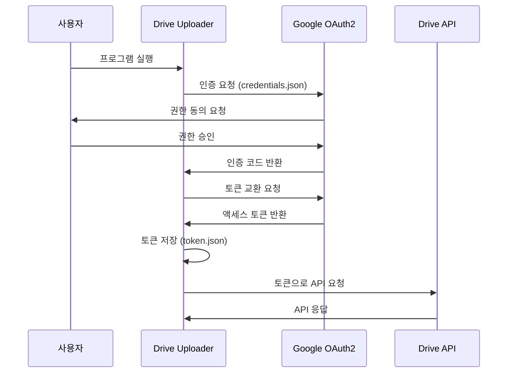

# 인증 관리

## OAuth2 인증 개요

Drive Uploader는 Google OAuth2를 사용하여 구글 드라이브에 안전하게 접근합니다. OAuth2는 사용자의 비밀번호를 직접 저장하지 않고, 액세스 토큰을 통해 API에 접근하는 방식입니다.

### 인증 흐름



## 인증 파일 구조

### credentials.json
Google Cloud Console에서 발급받은 클라이언트 자격 증명 파일:

```json
{
  "installed": {
    "client_id": "123456789-abcdef.apps.googleusercontent.com",
    "project_id": "drive-uploader-project",
    "auth_uri": "https://accounts.google.com/o/oauth2/auth",
    "token_uri": "https://oauth2.googleapis.com/token",
    "auth_provider_x509_cert_url": "https://www.googleapis.com/oauth2/v1/certs",
    "client_secret": "GOCSPX-abcdef123456",
    "redirect_uris": ["http://localhost"]
  }
}
```

### token.json
인증 성공 후 자동 생성되는 토큰 파일:

```json
{
  "access_token": "ya29.a0AfH6SMB-abcdef123456",
  "token_type": "Bearer",
  "refresh_token": "1//0abcdef123456",
  "expiry": "2025-01-15T10:30:00Z"
}
```

## 인증 명령어 (계획 중)

향후 버전에서는 다음과 같은 인증 관리 명령어가 지원될 예정입니다:

### auth list
```bash
# 인증된 계정 목록 조회
drive-uploader auth list

# 예상 출력
인증된 계정:
1. user@gmail.com (기본)
2. work@company.com
```

### auth login
```bash
# 새 계정 로그인
drive-uploader auth login

# 특정 이름으로 프로필 저장
drive-uploader auth login --profile "work"
```

### auth logout
```bash
# 특정 계정 로그아웃
drive-uploader auth logout user@gmail.com

# 모든 계정 로그아웃
drive-uploader auth logout --all

# 현재 계정 로그아웃
drive-uploader auth logout
```

### auth switch
```bash
# 다른 계정으로 전환
drive-uploader auth switch work@company.com

# 인덱스로 전환
drive-uploader auth switch 2
```

## 현재 인증 관리 방법

### 1. 인증 상태 확인

```bash
# 토큰 파일 존재 확인
ls -la token.json

# 토큰 내용 확인
cat token.json | python3 -m json.tool
```

### 2. 인증 초기화

```bash
# 토큰 파일 삭제로 인증 초기화
rm token.json

# 다음 실행 시 자동으로 재인증
drive-uploader -file test.txt
```

### 3. 수동 인증

인증에 문제가 있을 경우 수동으로 재인증:

```bash
# 1. 기존 토큰 삭제
rm token.json

# 2. 프로그램 실행하여 재인증
drive-uploader -file test.txt

# 3. 브라우저에서 인증 코드 받아 입력
```

## 다중 프로필 관리 (수동 방법)

현재 버전에서는 수동으로 다중 프로필을 관리할 수 있습니다:

### 1. 프로필별 디렉토리 구조

```bash
# 프로필별 디렉토리 생성
mkdir -p ~/.drive-uploader/profiles/personal
mkdir -p ~/.drive-uploader/profiles/work

# 개인용 credentials 복사
cp credentials.json ~/.drive-uploader/profiles/personal/
cp work-credentials.json ~/.drive-uploader/profiles/work/credentials.json
```

### 2. 프로필 전환 스크립트

```bash
#!/bin/bash
# switch-profile.sh

PROFILE="$1"
BASE_DIR="$HOME/.drive-uploader/profiles"

if [ -z "$PROFILE" ]; then
    echo "사용법: $0 <profile_name>"
    echo "사용 가능한 프로필:"
    ls "$BASE_DIR"
    exit 1
fi

PROFILE_DIR="$BASE_DIR/$PROFILE"

if [ ! -d "$PROFILE_DIR" ]; then
    echo "오류: 프로필이 존재하지 않습니다: $PROFILE"
    exit 1
fi

# 현재 프로필 백업
if [ -f "token.json" ]; then
    cp token.json "token.json.backup.$(date +%Y%m%d_%H%M%S)"
fi

# 프로필 파일 복사
cp "$PROFILE_DIR/credentials.json" .

# 해당 프로필 토큰이 있다면 복사
if [ -f "$PROFILE_DIR/token.json" ]; then
    cp "$PROFILE_DIR/token.json" .
fi

echo "프로필 전환 완료: $PROFILE"
```

### 3. 프로필 저장 스크립트

```bash
#!/bin/bash
# save-profile.sh

PROFILE="$1"
BASE_DIR="$HOME/.drive-uploader/profiles"

if [ -z "$PROFILE" ]; then
    echo "사용법: $0 <profile_name>"
    exit 1
fi

PROFILE_DIR="$BASE_DIR/$PROFILE"
mkdir -p "$PROFILE_DIR"

# 현재 토큰 저장
if [ -f "token.json" ]; then
    cp token.json "$PROFILE_DIR/"
    echo "프로필 저장 완료: $PROFILE"
else
    echo "경고: 저장할 토큰이 없습니다"
fi
```

## 보안 고려사항

### 1. 파일 권한 관리

```bash
# credentials.json 권한 설정 (소유자만 읽기)
chmod 600 credentials.json

# token.json 권한 설정
chmod 600 token.json

# 프로필 디렉토리 권한 설정
chmod 700 ~/.drive-uploader
```

### 2. 민감 정보 처리

- **버전 관리 제외**: `.gitignore`에 인증 파일 추가
- **백업 주의**: 인증 파일을 클라우드에 백업하지 않음
- **공유 금지**: credentials.json을 타인과 공유하지 않음

### 3. .gitignore 설정

```gitignore
# 인증 관련 파일
credentials.json
token.json
*.token.json

# 프로필 디렉토리
.drive-uploader/
```

## 인증 문제 해결

### 1. 토큰 만료 오류

**증상**: `invalid_token` 또는 만료 관련 오류

**해결책**:
```bash
# 토큰 삭제 및 재인증
rm token.json
drive-uploader -file test.txt
```

### 2. 잘못된 클라이언트 시크릿

**증상**: `invalid_client` 오류

**해결책**:
```bash
# 모든 인증 파일 삭제
rm credentials.json token.json

# Google Cloud Console에서 새 자격 증명 다운로드
```

### 3. 권한 거부

**증상**: `access_denied` 오류

**해결책**:
1. Google Cloud Console에서 OAuth 동의 화면 확인
2. 필요한 범위(`https://www.googleapis.com/auth/drive.file`)가 추가되었는지 확인
3. 테스트 사용자 목록에 계정이 포함되어 있는지 확인

### 4. 네트워크 문제

**증상**: 연결 타임아웃 또는 네트워크 오류

**해결책**:
1. 인터넷 연결 확인
2. 방화벽 설정 확인 (OAuth 포트)
3. 프록시 설정 확인 (기업 환경)

## 인증 모니터링

### 1. 토큰 상태 확인 스크립트

```bash
#!/bin/bash
# check-auth.sh

if [ ! -f "token.json" ]; then
    echo "상태: 인증되지 않음"
    echo "조치: drive-uploader -file <파일>로 인증 필요"
    exit 1
fi

# 토큰 만료 시간 확인
EXPIRY=$(cat token.json | python3 -c "import sys, json; print(json.load(sys.stdin).get('expiry', 'Unknown'))")
echo "토큰 만료 시간: $EXPIRY"

# 만료 확인
if [ "$EXPIRY" != "Unknown" ]; then
    EXPIRY_TIMESTAMP=$(date -d "$EXPIRY" +%s 2>/dev/null || date -j -f "%Y-%m-%dT%H:%M:%SZ" "$EXPIRY" +%s)
    CURRENT_TIMESTAMP=$(date +%s)
    
    if [ $EXPIRY_TIMESTAMP -lt $CURRENT_TIMESTAMP ]; then
        echo "상태: 토큰 만료됨"
        echo "조치: 재인증 필요"
    else
        echo "상태: 유효한 토큰"
    fi
fi
```

### 2. 자동 인증 갱신 (향후 기능)

```bash
#!/bin/bash
# auto-refresh.sh

# 토큰 상태 확인
./check-auth.sh

# 만료된 경우 재인증 시도
if [ $? -ne 0 ]; then
    echo "자동 재인증 시도 중..."
    # 여기에 자동 재인증 로직 추가 (향후 구현)
fi
```

## 다음 단계

개발자를 위한 상세 기여 가이드는 [개발 가이드](06_개발_가이드.md)를 참고하세요.
